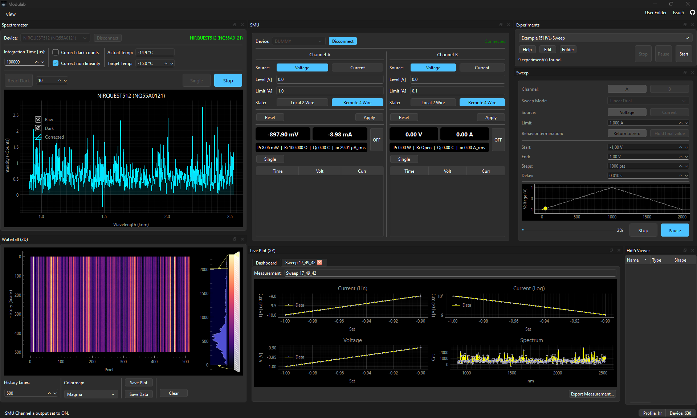

# Modulab

**Modulare Mess- und Steuerungssoftware für die Halbleitercharakterisierung**

Entwickelt am **Institut für Halbleitertechnik (IHT)** der Universität Stuttgart.

---

## Inhaltsverzeichnis

1. [Übersicht](#übersicht)
2. [Benutzer-Anleitung](#benutzer-anleitung)
    * [Installation](#installation)
    * [Screenshots](#screenshots)
    * [Speicherorte und Logs](#speicherorte-und-logs)
    * [Experimente automatisieren (Skripting)](#experimente-automatisieren-skripting)
3. [Entwickler-Guide](#entwickler-guide)
    * [Voraussetzungen](#voraussetzungen)
    * [Installation der Entwicklungsumgebung](#installation-der-entwicklungsumgebung)
    * [Starten und Builden](#starten-und-builden)
    * [Dokumentation generieren (Sphinx)](#dokumentation-generieren-sphinx)
4. [Software-Architektur](#software-architektur)
    * [Projektstruktur](#projektstruktur)
    * [Design-Konzepte](#design-konzepte)
5. [Modul-Beschreibung](#modul-beschreibung)
6. [Troubleshooting (FAQ)](#troubleshooting-faq)
7. [Erweiterung der Software](#erweiterung-der-software)

---

## Übersicht

**Modulab** ist eine Python-basierte Desktop-Anwendung (PySide6/Qt), die entwickelt wurde, um komplexe physikalische Messaufbauten zu steuern. Der Fokus liegt auf Flexibilität, Stabilität und Modularität. Die Software ermöglicht die synchrone Ansteuerung von Source Measure Units (SMUs) und Spektrometern, visualisiert Daten in Echtzeit und bietet eine integrierte Experiment-Skripting-Umgebung.

**Hauptfunktionen:**

* **Gerätesteuerung:**
    * **SMU:** Volle Unterstützung für Keithley 2600 Series (2602, etc.) via Serial/USB.
    * **Spektrometer:** Integration von Ocean Optics Spektrometern (via `seabreeze`).
* **Messmodi:**
    * **Live-Plotting:** Echtzeit-Visualisierung von I-V-Kurven und Spektren.
    * **Waterfall-Diagramm:** Hochperformante Darstellung zeitlicher Spektralverläufe (Heatmap).
    * **Sweeps:** Konfigurierbare Spannungs-/Strom-Sweeps mit automatischen Limits.
* **Automatisierung:** Integrierter Python-Interpreter erlaubt das Schreiben und Ausführen eigener Experiment-Skripte ohne Neustart der Software.
* **Datenexport:**
    * **HDF5:** Performantes, binäres Format für große Datensätze (inkl. Metadaten).
    * **CSV:** Kompatibel mit Origin/Excel.

---

## Benutzer-Anleitung

### Installation

Für Anwender, die die Software nur nutzen möchten (keine Programmierung):

1.  Laden Sie die aktuelle Version (`.exe`) von der GitHub Releases-Seite herunter.
2.  Starten Sie `Modulab.exe`.
3.  Es ist keine weitere Installation von Python notwendig, da die EXE alle Abhängigkeiten enthält.

### Screenshots


*Die Hauptansicht mit Spektrometer-Live-Plot und SMU-Steuerung.*


### Speicherorte und Logs

Modulab legt alle benutzerdefinierten Daten im Home-Verzeichnis des Nutzers ab, um Konflikte mit Installationsrechten zu vermeiden.

* **Hauptverzeichnis:** `C:\Users\<Benutzername>\Modulab\`
* **Logs:** `...\Modulab\Logs\`
    * Hier werden Textdateien (`log_YYYY-MM-DD...`) gespeichert. Diese sind bei Fehlern zur Diagnose essenziell.
* **Profile:** `...\Modulab\Profiles\`
    * Speichert Einstellungen (z.B. letzte Integrationszeit, Fensterpositionen) als `.json`.
* **Experimente:** `...\Modulab\Experiments\`
    * Hier legen Sie Ihre Python-Skripte ab, die im "Experiment"-Tab angezeigt und ausgeführt werden sollen.


## Experimente automatisieren (Skripting)

Eine der Stärken von Modulab ist die Möglichkeit, komplexe Messabläufe als Python-Skripte zu definieren. Skripte werden im Ordner `Experiments/` abgelegt und erscheinen automatisch in der GUI.

### API-Referenz (Handbuch)

Um zu wissen, welche Befehle verfügbar sind (z.B. `api.smu_mgr.set_voltage()` oder `api.spectrometer_mgr.acquire_spectrum()`), steht eine vollständige HTML-Dokumentation zur Verfügung.

Diese Dokumentation wird aus dem Quellcode generiert und enthält alle Details zu den Managern und Klassen.

**So öffnen Sie die Dokumentation:**
1.  Navigieren Sie in Ihren Projektordner.
2.  Öffnen Sie die Datei: `docs\_build\html\index.html` in Ihrem Browser.

*(Hinweis: Falls dieser Ordner leer ist, lesen Sie im Abschnitt "Entwickler-Guide" unter "Dokumentation generieren", wie Sie diese erstellen).*

### Beispiel-Skript

Ein minimales Beispiel für einen Sweep sieht so aus:

```python
import time

def run_experiment(api):
    """Mein erstes Experiment"""
    smu = api.smu_mgr
    log = api.log_mgr
    
    log.info("Starte Messung...")
    
    # Zugriff auf Hardware über die Manager
    smu.connect("COM3")
    smu.set_source_voltage('a')
    smu.set_output_state('a', True)
    
    # Messung
    smu.set_source_level('a', 5.0)
    time.sleep(0.1)
    curr, volt = smu.measure_iv('a')
    
    log.info(f"Gemessen: {curr} A bei {volt} V")
    
    smu.set_output_state('a', False)
```
---

## Entwickler-Guide

Dieser Abschnitt richtet sich an Studenten und Entwickler, die Modulab erweitern oder Fehler beheben möchten.

### Voraussetzungen

* **Python:** Version 3.10 oder neuer.
* **Git:** Zum Klonen des Repositories.
* **IDE:** Empfohlen wird Visual Studio Code (VS Code).

### Installation der Entwicklungsumgebung

Um Konflikte zu vermeiden, nutzen wir eine virtuelle Umgebung (venv).

1.  **Repository klonen:**
    ```bash
    git clone [https://github.com/Silas-Hoerz/Modulab.git](https://github.com/Silas-Hoerz/Modulab.git)
    cd Modulab
    ```

2.  **Virtuelle Umgebung erstellen und aktivieren:**
    Öffnen Sie ein Terminal im Projektordner:
    ```powershell
    # Windows PowerShell
    python -m venv .venv
    .venv\Scripts\Activate.ps1
    ```
    *(Hinweis: Falls Fehler bezüglich Skriptausführung auftreten, nutzen Sie `Set-ExecutionPolicy RemoteSigned -Scope CurrentUser`)*.

3.  **Abhängigkeiten installieren:**
    ```powershell
    pip install --upgrade pip
    pip install -r requirements.txt
    ```

### Starten und Builden

**Software starten (Development Mode):**
```powershell
# Startet die Anwendung über den Entry-Point
python main.py

```

**Executable (.exe) erstellen:**
Wir nutzen PyInstaller, um eine alleinstehende Anwendung zu erzeugen. Die Konfiguration liegt in `Modulab.spec`.

```powershell
# Stellen Sie sicher, dass das venv aktiv ist
pyinstaller --noconfirm Modulab.spec

```

Das Ergebnis befindet sich im Ordner `dist/Modulab/`.

### Dokumentation generieren (Sphinx)

Die technische API-Dokumentation (Klassen, Methoden) wird automatisch aus den Docstrings generiert.

1. Wechseln Sie in den Ordner `docs/`:
```powershell
cd docs

```


2. Starten Sie den Build-Prozess:
```powershell
./make.bat html

```


3. Öffnen Sie `docs/_build/html/index.html` im Browser, um die Dokumentation zu sehen.

---

## Software-Architektur

Das Projekt folgt einer strikten Trennung zwischen Kern-System (`core`), Fachmodulen (`modules`) und Ressourcen.

### Projektstruktur

```text
Modulab/
├── core/                   # Kernkomponenten
│   ├── context.py          # Central Service Container (Dependency Injection)
│   ├── mainwindow.py       # Hauptfenster, Docking-Layout & Menüs
│   └── ...
├── modules/                # Fachliche Komponenten (Hardware & Logik)
│   ├── smu/                # Source Measure Unit (Keithley)
│   ├── spectrometer/       # Ocean Optics Spektrometer
│   ├── experiment/         # Skript-Runner & Worker-Threads
│   ├── waterfall/          # 2D-History Plot
│   ├── liveplot/           # X-Y Plotting
│   ├── export/             # HDF5/CSV Writer
│   └── ...
├── scripts/                # Beispiel-Experimente
└── main.py                 # Einstiegspunkt

```

### Design-Konzepte

1. **Dependency Injection (`ApplicationContext`):**
Es gibt keine globalen Variablen. Der `ApplicationContext` wird in `main.py` erstellt und hält Referenzen zu allen Managern (Logik). Er wird an alle Widgets (UI) übergeben, sodass diese Zugriff auf die Logik haben, ohne direkt voneinander abzuhängen.
2. **Trennung von Logik (Manager) und UI (Widget):**
* **Manager (z.B. `SmuManager.py`):** Enthält die Hardware-Treiber, Datenhaltung und Business-Logik. Erbt von `QObject` und kommuniziert über Signale. Kennt keine UI-Elemente.
* **Widget (z.B. `SmuWidget.py`):** Enthält die grafische Oberfläche. Ruft Methoden am Manager auf und reagiert auf dessen Signale.


3. **Threading und Sicherheit:**
* **GUI-Thread:** Behandelt Benutzerinteraktion und Visualisierung.
* **Worker-Thread:** Der `ExperimentManager` führt Benutzer-Skripte in einem separaten `QThread` aus, um das Einfrieren der GUI zu verhindern.
* **Thread-Safety:** Kritische Hardware-Zugriffe in den Managern sind durch `QRecursiveMutex` geschützt, um Konflikte zwischen GUI-Polling und Experiment-Skripten zu verhindern.


---

## Modul-Beschreibung

### SMU Modul (`modules/smu`)

Steuert Keithley 2600 Geräte. Der Treiber `Keithley2602.py` kapselt serielle SCPI-Befehle. Der Manager stellt sicher, dass Befehle thread-safe gesendet werden. Enthält einen `DummyKeithley2602` für Tests ohne Hardware.

### Spektrometer Modul (`modules/spectrometer`)

Steuert Ocean Optics Geräte via `seabreeze`. Unterstützt Dunkelspektrum-Subtraktion und Linearitätskorrektur. Das Spektrometer wird automatisch im Hintergrund verwaltet (Verbindung, Reconnect).

### Experiment Modul (`modules/experiment`)

Das Herzstück für Automatisierung. Nutzer schreiben Python-Files mit einer `run_experiment(api)` Funktion. Das `api`-Objekt erlaubt Skripten den einfachen Zugriff auf alle Manager.

### Daten-Export (`modules/export`)

Daten werden während der Messung in einer `MeasurementSession` im RAM gesammelt und am Ende exportiert. Unterstützt HDF5 (inkl. Metadaten) und CSV.

---

## Troubleshooting (FAQ)

**1. Mein Gerät wird nicht erkannt.**

* **SMU:** Prüfen Sie den Treiber und den Geräte-Manager (COM-Port). Nutzen Sie den Refresh-Button im SMU-Widget.
* **Spektrometer:** Modulab nutzt `seabreeze`. Stellen Sie sicher, dass die Ocean Optics Treiber korrekt installiert sind.

**2. Die Software hängt beim Start (Splash Screen).**
Dies passiert, wenn ein vorheriger Prozess nicht sauber beendet wurde und den COM-Port blockiert. Beenden Sie alle `Modulab.exe` oder `python.exe` Prozesse im Task-Manager.

**3. Fehler "File locked" beim Export.**
HDF5-Dateien können nicht von zwei Programmen gleichzeitig geöffnet sein. Schließen Sie Viewer wie HDFView oder Silx vor dem Speichern.

**4. Das Programm stürzt ab, wenn ich während einer Messung Einstellungen ändere.**
Die Widgets sperren nun automatisch Eingabefelder, sobald ein Experiment gestartet wird (`ExperimentManager` Signale), um Inkonsistenzen und Abstürze durch Race Conditions zu vermeiden.

---

## Erweiterung der Software

Anleitung zum Hinzufügen eines neuen Messgeräts:

1. **Treiber erstellen:** Schreiben Sie eine Klasse in `modules/<neues_gerät>/Treiber.py`, die die Low-Level-Kommunikation kapselt.
2. **Manager implementieren:** Erstellen Sie einen `Manager.py` (erbt von `QObject`). Implementieren Sie Signale für neue Daten und nutzen Sie `QMutex` für Thread-Sicherheit.
3. **Registrierung:** Fügen Sie den neuen Manager in `core/context.py` hinzu (`self.new_manager = ...`).
4. **UI erstellen:** Bauen Sie ein Widget, das auf den Manager zugreift, und binden Sie es in `core/mainwindow.py` in das Docking-System ein.


